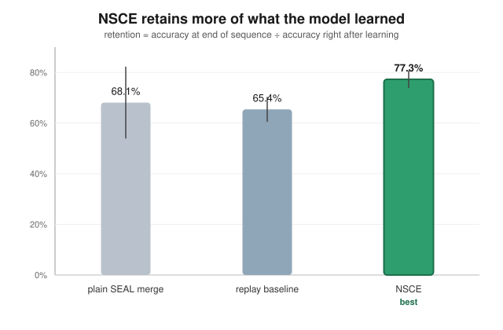
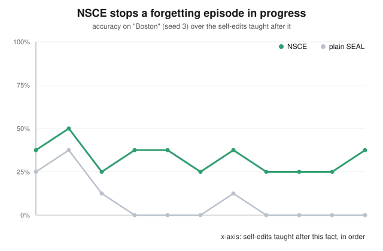

# NSCE results — TL;DR

SEAL trains a model to write its own training data ("self-edits") and merge
it permanently into its weights. The SEAL paper (arXiv 2506.10943) admits
this causes catastrophic forgetting when you do it repeatedly — new
self-edits overwrite old ones. In their limitations section they mention
"null-space constrained edits" as a possible fix, but never actually build
or test it. That's what this does.

**The idea:** before merging a new self-edit into the weights, figure out
which directions in the model's activations it actually uses to recall
previously-taught facts, and constrain the new update so it can't write into
those directions. Math is in the main README. I tested it against plain SEAL
merging and against a simple "replay old examples" baseline, using the same
self-edits for all three so it's a fair comparison, across 3 separate
15-article sequences.

## The result

| condition | retention (% of a fact remembered by the end vs. right after learning it) |
|---|---|
| plain SEAL merge | 68.1% (±14.2) |
| replay baseline | 65.4% (±4.9) |
| NSCE | **77.3% (±3.4)** |

NSCE comes out ahead , the whole gap comes from one
sequence where plain SEAL had a bad forgetting episode (down to 40%
retention) and NSCE didn't (83%).

Here's the clearest single example, from that sequence: an article about
Boston gets answered correctly 25% of the time right after the model is
taught it. Ten self-edits later (all on unrelated topics), plain SEAL's
version of the model has completely forgotten it — 0%. NSCE's version is
still at 38%, untouched.

So the honest takeaway isn't "NSCE makes the model remember more on
average," it's "NSCE stops the worst forgetting episodes from happening."
Which is actually closer to what "catastrophic" forgetting is supposed to
mean anyway , not a slow leak, but a sudden collapse.

## If you want more detail

- `../README.md` has the full writeup — the actual math, what broke while I
  was building this (a decent amount, since a training loop that quietly
  produces garbage output makes any forgetting comparison meaningless, so
  most of the real work was making sure that wasn't happening), and what I'd
  do next with more time.
- `comparison_summary.json` has the raw numbers behind the table above.
- `runs/` has the full per-step results for every individual run.

<!-- visualize_results:start -->
## Visualized

NSCE comes out ahead on retention, and the clearest example of why is above: a fact ("Boston", seed 3) that plain SEAL merging lets collapse to near-zero recall gets held onto by NSCE instead.

### Per-seed retention

| seed | plain SEAL merge | replay baseline | NSCE |
|---|---|---|---|
| 1 | **85.7%** | 75.0% | 77.1% |
| 2 | **78.6%** | 58.8% | 71.4% |
| 3 | 40.0% | 62.5% | **83.3%** |

### NSCE is the consistent one

Plain SEAL merging swings from 40.0% retention on its worst seed up to 85.7% on its best — a 45.7-point spread, because whether it collapses depends on which facts happen to collide with which self-edits. NSCE's seeds land within 11.9 points of each other (71.4%–83.3%) — roughly a quarter of baseline's spread. NSCE's *worst* seed (71.4%) still beats both plain SEAL's worst (40.0%) and replay's worst (58.8%).

### Retention doesn't cost plasticity

NSCE constrains *where* a self-edit can write, so it's fair to ask whether that gets in the way of learning the new fact in the first place. It doesn't: NSCE's accuracy right after teaching a fact (plasticity) averages 9.2%, versus 7.5% for plain SEAL merging — the constraint isn't trading away learning to get retention, it's improving both.

*Generated locally by `visualize_results.py` — static SVGs and markdown, no server.*
<!-- visualize_results:end -->
